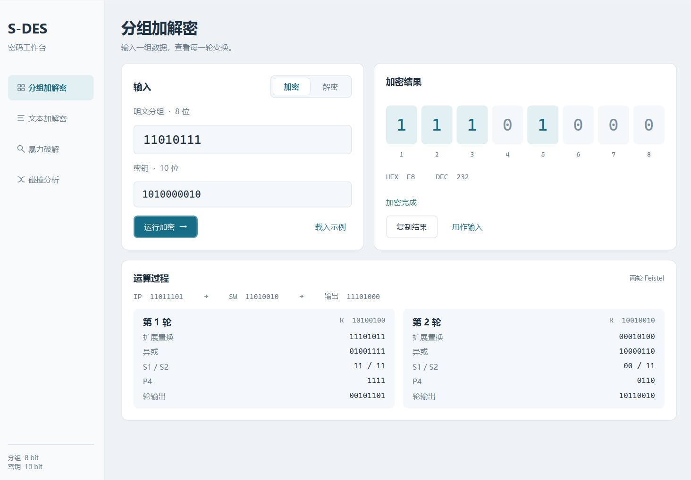
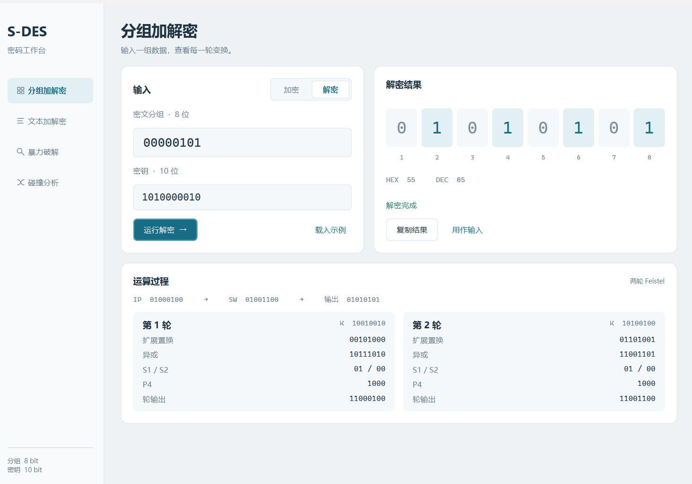
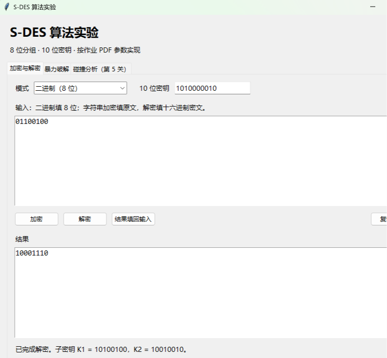

# 测试结果

测试时间：2026-09-23 23:16:55（本机系统时间）

交叉互测时间：2026-10-07

环境：Windows 11，Python 3.13.5，Tkinter 8.6。

参数约定：作业 PDF 修改后的 S 盒；K1、K2 相对 P10 后的原始半部分分别循环左移 1、2 位。详见 README 中的算法约定。

## 完成情况

| 关卡 | 结果 |
| --- | --- |
| 第 1 关：基本测试 | 已完成。GUI 加解密正常，全密钥和全明文空间的还原检查通过 |
| 第 2 关：交叉测试 | 本地两套独立实现核对通过；已与扶满组完成真实跨组加解密互测，结果一致 |
| 第 3 关：扩展功能 | 已完成 ASCII 字符串加解密；网络通信未作为本次扩展内容 |
| 第 4 关：暴力破解 | 已完成单组、多组明密文对搜索，显示全部候选、进度和时间 |
| 第 5 关：封闭测试 | 已按题目问题完成密钥碰撞分析，并检查全部 256 个明文 |

## 第 1 关：基本测试

穷举 1024 个密钥和每个密钥下的 256 个明文，共 262144 种组合，验证解密还原原文。每个固定密钥下，256 个明文产生 256 个不同密文。全部通过。

示例子密钥：密钥 `1010000010` 得到 K1 = `10100100`，K2 = `10010010`。

| 密钥 | 明文 | 密文 |
| --- | --- | --- |
| 1010000010 | 00000000 | 01101010 |
| 1010000010 | 01010101 | 00000101 |
| 1010000010 | 11010111 | 11101000 |
| 1010000010 | 11111111 | 10001110 |

GUI 程序化运行检查通过：二进制加解密、结果填回输入、ASCII 还原、保留空白字符、复制结果、错误输入提示、暴力破解、停止并重启、无解提示、碰撞分析。

## 第 2 关：交叉测试

`test_sdes.py` 中另写了字符串逐位处理的参考加密实现，与主程序的整数位运算实现独立核对全部 262144 种输入组合，结果一致。这属于本地实现互验，不能代替与其他小组的真实交叉测试。

`cross_test_cases.json` 提供 16 组二进制测试数据和 3 组字符串数据。双方先统一 S 盒与密钥移位规则，再用相同密钥进行已知向量核对和跨程序加解密验证。

| 项目 | 记录 |
| --- | --- |
| 我方成员 | 李美霖、林家辉 |
| 互测小组 | 扶满组（提交编号 `992987-001`） |
| 对方成员 | 花谱谱pupu、黎旭涛、扶满 |
| 我方程序 | Python 3 + Tkinter，[S-DES-Python](https://github.com/leemeii/S-DES-Python) |
| 对方程序 | Web 版 S-DES 密码工作台，[Cyanlament/realization-of-S-DES-algorithm](https://github.com/Cyanlament/realization-of-S-DES-algorithm) |
| 参数约定 | 双方采用相同的 P 盒、修改后的 S 盒及密钥移位规则 |
| 互测日期 | 2026-10-07 |
| 互测结论 | 已知向量一致，且对方加密结果可由我方程序正确解密，交叉互测通过 |

### 已知向量核对

扶满组程序使用密钥 `1010000010` 加密明文 `11010111`，得到密文 `11101000`。该结果与本仓库 `cross_test_cases.json` 中的预期结果一致；界面中显示的子密钥 K1 = `10100100`、K2 = `10010010` 也与我方程序一致。



扶满组程序使用同一密钥解密密文 `00000101`，还原明文 `01010101`，与我方测试向量一致。解密界面按 K2、K1 的顺序执行两轮 Feistel 运算。



### 跨程序加解密验证

扶满组程序使用密钥 `1010000010` 加密互测明文 `10001110`，生成密文 `01100100`。


随后将密文 `01100100` 和相同密钥输入我方 Tkinter 程序，我方程序成功解密并还原出明文 `10001110`。这组结果证明两组程序不仅预置测试向量一致，而且能够互相处理对方生成的数据。



## 第 3 关：ASCII 扩展

测试空字符串、普通英文、前后空格、换行、制表符、NUL 字符和全部 128 个 ASCII 字符。在密钥 0、642、1023 下均能还原。每个输入字符对应一个密文字节。

示例：

```text
密钥：1010000010
原文：Hello, S-DES!
十六进制密文：E4 5C 89 89 AB DD C2 CB 56 9B 30 CB AD
解密结果：Hello, S-DES!
```

非法二进制、超范围分组或密钥、中文、表情、非法或不完整的十六进制密文均被拒绝。密文显示为十六进制以避免不可打印字节丢失；没有改用 UTF-8 来放宽 ASCII 范围。

## 第 4 关：暴力破解

用于演示的真实密钥为 `1010000010`。前两组已知明密文对如下，可直接复制到界面：

```text
00000000 01101010
00000001 01000101
```

本机单次计时结果如下，仅包含搜索计算，不包含 GUI 调度，实际耗时随设备和负载变化。

| 已知明密文对数量 | 遍历 1024 个密钥的耗时 | 所有候选密钥 |
| --- | --- | --- |
| 1 组 | 0.009505 秒 | 0001010010, 0101010010, 1010000010, 1110000010 |
| 2 组 | 0.008816 秒 | 1010000010, 1110000010 |
| 256 组 | 0.010903 秒 | 1010000010, 1110000010 |

另外，输入同一明文对应两个不同密文的矛盾条件时，程序正确返回无匹配密钥。GUI 支持停止，并明确标出停止后的结果不完整。

## 第 5 关：密钥碰撞分析

第一问：一组明密文对可能对应多个密钥。例如上面的第一组得到 4 个候选密钥。

第二问：对任意固定的 8 位明文，都存在不同密钥得到相同密文。原因是 1024 个密钥最多只能映射到 256 个密文，依据抽屉原理一定发生碰撞。

穷举全部 256 个明文后，统计如下：

| 对一个明文产生的不同密文数 | 具有该统计结果的明文数量 |
| --- | --- |
| 254 | 256 |

各明文中，对应多个密钥的密文数量范围为 254–254；单个密文的最大候选密钥数量范围为 8–8。

本次参数约定还产生了等效密钥：全部 1024 个密钥仅生成 512 种不同的子密钥对，每种恰好出现 2 次。原密钥从左数第 2 位不会进入两个子密钥，因此任意密钥 `K` 与 `K XOR 0100000000` 生成相同的子密钥对。

例如 `1010000010` 和 `1110000010` 对所有 256 个明文都有相同的加密结果。所以增加明密文对可以减少候选，但在这一规则下无法区分这两个等效密钥。该结论针对 README 中采用的移位规则，不应直接套用到累计左移 3 位的另一种实现。

## 自动测试复现

在项目目录运行 `python test_sdes.py`。本次 10 项自动测试全部通过，完整日志见 `测试日志.txt`。这些测试覆盖全空间可逆性、独立参考实现、密钥扩展、等效密钥、字符串、输入检查、明密文对解析、暴力破解和碰撞分组。

小组成员与分工见 README。项目仓库为 [leemeii/S-DES-Python](https://github.com/leemeii/S-DES-Python)；提交前需将本次更新推送到仓库，并向指定石墨表格提交最终仓库链接。
